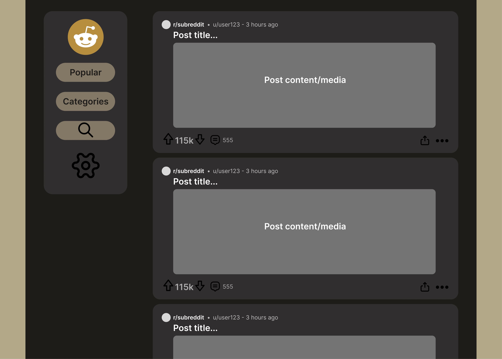

# Reddit App Project

## Description
    

## Details

### Features
    1. Search function 
    2. Filter feed with predefined categories
    3. Page route that changes when traveling the site
    4. Cohesive design system
    5. Animations and transitions
    6. 

### Wire frames:

### Technologies used:

### Future work

### Project requirements
    1. Use React and Redux
    2. Used tests with Jest and Enzyme
    3. Optimize the app for any device
    4. Optimize browser compatibility
    5. Accessible URL
    6. Users able to leave different error states
    7. Get 90+ rating in lighthouse

### To Do:
    1. optimize navbar and content for smaller screen (done)
    2. add media function to posts
    3. start figuring how to implement API calls
    4. implement data from API calls to feed
    5. implement home function (refresh API calls)
    6. implement popular view function
    7. implement search function
    8. implement filter for category function
    9. implement user profile function
    10. implement user settings function
    11. implement user login function
    12. implement user logout function
    13. implement user signup function
    14. implement user post function
    15. implement user comment function
    16. implement user upvote function
    17. implement user downvote function
    18. implement user save function
    19. implement user share function
    20. implement user report function
    